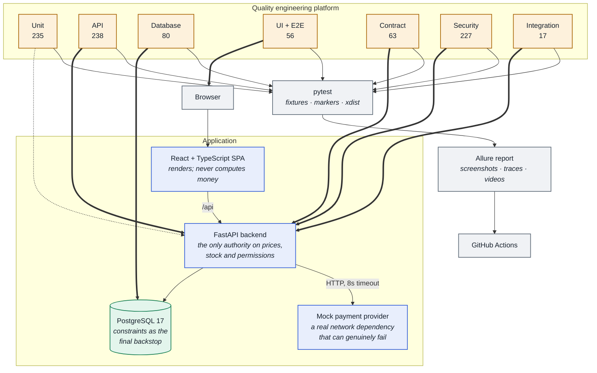
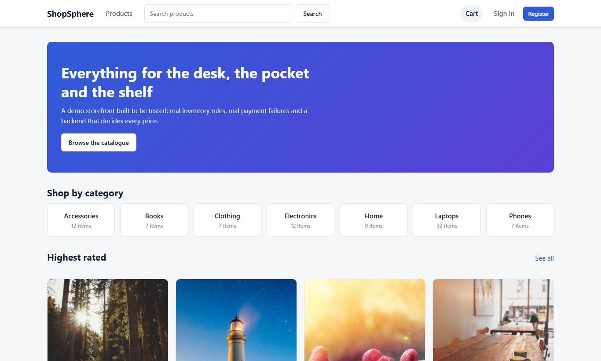
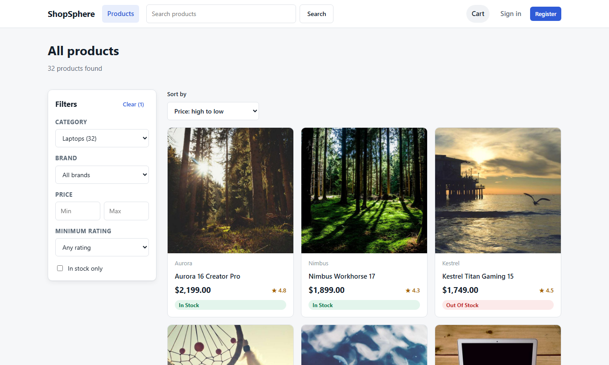
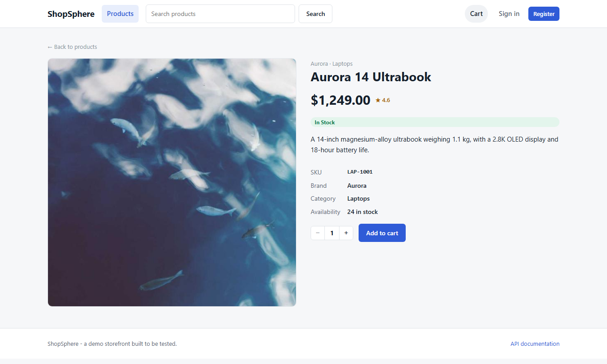
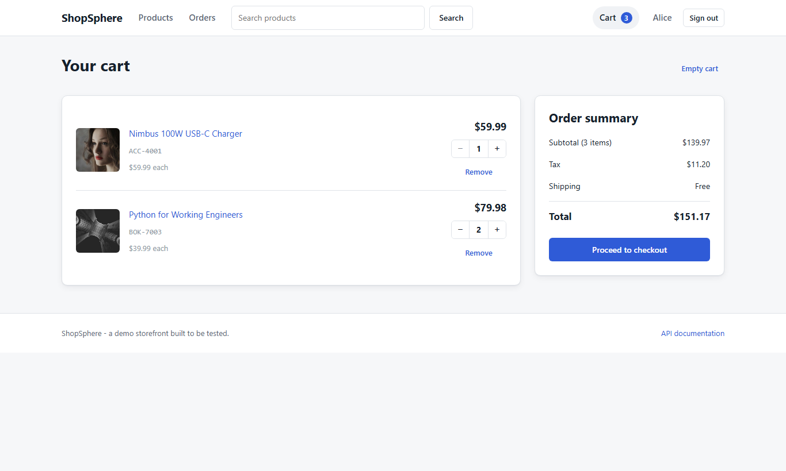
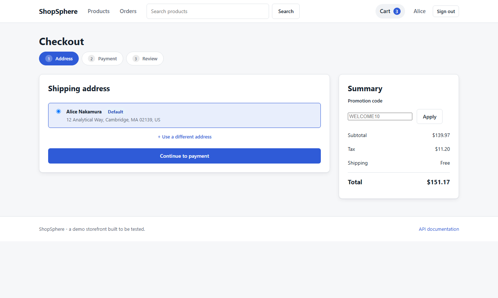
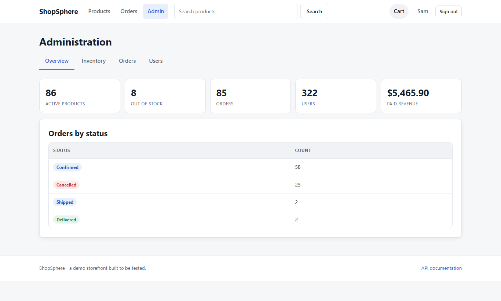

# ShopSphere

**An e-commerce application, and the quality engineering platform that tests it.**

[](https://github.com/NikeshWalia/shopsphere/actions/workflows/ci.yml)
[](https://www.python.org/)
[](https://fastapi.tiangolo.com/)
[](https://react.dev/)
[](https://www.postgresql.org/)
[](https://playwright.dev/)
[](#what-actually-runs)
[](#code-quality)

---

## What this is

Most testing portfolios automate somebody else's demo site. This one builds the
system *and* the harness, because the interesting problems in quality
engineering only appear when you own both.

ShopSphere is a working storefront: real inventory, real money arithmetic, real
authorisation, and a payment provider that can genuinely fail. Around it sits a
test platform of **916 tests** across seven layers, from pure unit tests of the
pricing rules to full browser journeys.

**It was built so it could be broken.** Along the way the suite found six real
defects in the application — including an oversell race that let two customers
buy the same unit, and a single character that could 500 any endpoint. Each is
documented below with the fix.

> **New to the project?** [`docs/overview.md`](docs/overview.md) explains all of
> it in plain English, without assuming you know the tools.

---

## Contents

- [Quick start](#quick-start)
- [Architecture](#architecture)
- [The application](#the-application)
- [The quality engineering platform](#the-quality-engineering-platform)
- [What actually runs](#what-actually-runs)
- [Defects the suite found](#defects-the-suite-found)
- [Running the tests](#running-the-tests)
- [Reporting](#reporting)
- [Failure simulation](#failure-simulation)
- [Performance testing](#performance-testing)
- [Security testing](#security-testing)
- [Parallel execution](#parallel-execution)
- [CI/CD](#cicd)
- [Tech stack, and why](#tech-stack-and-why)
- [Project structure](#project-structure)
- [Architecture decisions](#architecture-decisions)
- [Known limitations](#known-limitations)
- [Future improvements](#future-improvements)

---

## Quick start

### Everything in Docker (one command)

```bash
git clone https://github.com/NikeshWalia/shopsphere.git
cd shopsphere
cp .env.example .env
docker compose up --build
```

Compose starts PostgreSQL, applies migrations, seeds 63 products, and brings up
the API, the mock payment provider and the storefront. Every service has a
healthcheck and every dependency waits on it, so there is nothing to sleep for.

| | |
| --- | --- |
| Storefront | <http://localhost:3000> |
| API docs (Swagger) | <http://localhost:8000/docs> |
| Payment provider | <http://localhost:9100/docs> |

**Demo accounts.** The seeder prints the admin and customer credentials when it
runs, so they are never published here. Defaults live in `.env.example` and are
placeholders — set your own before first seed:

```bash
SEED_ADMIN_EMAIL=you@example.test
SEED_ADMIN_PASSWORD=<something only you know>
SEED_CUSTOMER_EMAIL=customer@example.test
SEED_CUSTOMER_PASSWORD=<something only you know>
```

`.env` is gitignored. Keeping real credentials out of the repository is the
point: a password committed once stays in the git history even after it is
edited out, and anything published alongside a public repo should be assumed
compromised. The seeder is the only place the pair is ever displayed.

### Running the services directly

```bash
python -m venv .venv && source .venv/bin/activate   # Windows: .venv\Scripts\activate
make install-all            # backend + test + dev + Playwright + Locust
make frontend-install
cp .env.example .env        # then point DATABASE_URL at your PostgreSQL

make migrate && make reseed
make payment-mock &         # :9100
make backend &              # :8000
make frontend &             # :5173
```

`make help` lists every target.

On Windows, `scripts/local-stack.ps1` does all of the above in one command:

```powershell
.\scripts\local-stack.ps1 start     # starts all four services, waits for each
.\scripts\local-stack.ps1 status    # what is up right now
.\scripts\local-stack.ps1 stop      # clean shutdown, database flushed to disk
```

It expects PostgreSQL under `~/shopsphere-data`; set `SHOPSPHERE_DATA` if
yours lives elsewhere.

---

## Architecture



Thick arrows are the test platform driving a **real, running** component — no
mocks, no in-process test client. Full component diagram, ERD and the checkout
sequence diagram: **[docs/architecture.md](docs/architecture.md)**.

---

## The application

### Storefront

Home, product listing with search / filter / sort / pagination, product detail,
registration, login, cart, a four-step checkout, order confirmation, order
history and detail, profile, address book, and an admin console (dashboard,
inventory, orders, users).

| | |
| --- | --- |
|  |  |
| **Home** — categories, highest rated, new arrivals | **Catalogue** — filters, sorting, stable pagination |
|  |  |
| **Product detail** — stock-aware quantity stepper | **Cart** — every figure computed server-side |
|  |  |
| **Checkout** — address, payment, review, with test cards | **Admin** — inventory, orders, users, dashboard |

### API

`63` seeded products across `7` categories and `12` brands, and **37 REST
endpoints** under `/api/v1` covering authentication, catalogue, cart,
addresses, checkout, orders and administration. Full interactive documentation
at `/docs`.

Three conventions hold everywhere:

```jsonc
// Errors — one envelope, from every layer
{ "error": "INSUFFICIENT_INVENTORY",
  "message": "Only 2 units of 'Aurora 14 Ultrabook' are available",
  "details": { "product_id": 7, "requested": 5, "available": 2 } }

// Money — always a JSON number, never a string
{ "price": 1249.00, "tax": 99.92, "total": 1348.92 }

// Collections — always the same pagination envelope
{ "items": [], "total": 63, "page": 1, "page_size": 20,
  "total_pages": 4, "has_next": true, "has_previous": false }
```

### The rules the backend enforces

| # | Rule | Where it is proved |
| --- | --- | --- |
| 1 | Nobody buys more than exists | unit → API → DB `CHECK` → concurrency test |
| 2 | Nobody reads another customer's orders | security (IDOR, parametrised) |
| 3 | Customers cannot reach `/admin/*` | security (every admin endpoint) |
| 4 | The client never dictates a price | API (tampered bodies are ignored) |
| 5 | A failed payment never produces a paid order | API + integration + database |
| 6 | The quoted total is the charged total | unit + API + contract |
| 7 | Stock decrements on success | database (before/after) |
| 8 | Cancellation restores stock | API + database |
| 9 | One intent, one order | API + 5-way concurrent race |
| 10 | Tests are independent | fixture design; provable under `-n auto` |

---

## The quality engineering platform

```
tests/
├── api/          clients/   reusable HTTP clients, one per bounded context
│                 tests/     status · body · schema · headers · timing · rules
├── ui/           pages/     Page Objects (locators, not actions)
│                 tests/     component behaviour + full E2E journeys
├── database/     queries/   every SQL statement (never inline in a test)
│                 tests/     schema contract + what the API actually persists
├── integration/             multi-component journeys and real concurrency races
├── contract/               live responses validated against the live OpenAPI spec
├── security/               authz · IDOR · injection · headers · data exposure
├── performance/  locust/   weighted user model + staged load shape
├── fixtures/               pytest fixtures, split by concern
├── test_data/              factories and parametrised datasets
├── utilities/              HTTP wrapper · JWT minting · deterministic waits
└── configuration/          one settings object; everything from the environment
```

Three properties hold throughout, and are the reason the suite is trustworthy:

**Nothing is shared that can be mutated.** Every test that changes state creates
it, with identity from a UUID rather than a counter or a cleanup step — so it
cannot collide across parallel workers or repeated runs.

**Nothing sleeps.** `grep -rn "time.sleep" tests/` returns nothing. Waiting is
either Playwright's auto-waiting or an explicit condition poll.

**Nothing is hardcoded.** Every URL, credential and DSN comes from the
environment, so the identical suite runs locally, against Compose and in CI.

Full reasoning: **[docs/test-strategy.md](docs/test-strategy.md)**.

---

## What actually runs

Measured on this machine (Windows 11, 16 cores, Python 3.13, PostgreSQL 17
local), not estimated:

| Suite | Tests | Needs | Time |
| --- | ---: | --- | ---: |
| Unit (`backend/tests`) | 235 | nothing | 2.5s |
| API | 238 | API + DB | 2m 49s |
| Security | 227 | API + DB | 2m 00s |
| UI + E2E | 56 | full stack + browser | 1m 14s |
| Database | 80 | API + DB | 15s |
| Contract | 63 | API | 29s |
| Integration | 17 | full stack | 37s |
| **Total, sequential** | **916** | | **5m 51s** |
| **Total, `make test-parallel`** | **916** | | **3m 44s** |

Reproduce with `make test` and `make test-parallel`. Each suite was timed from a
freshly seeded database; a run against a database full of accumulated test data
is slower, which is itself a reason `make reseed` exists.

`make test-parallel` splits into three groups — 852 non-UI tests at `-n auto`
(1m 38s), 56 UI tests at `-n 4` (1m 43s), and 8 `serial` tests sequentially
(22s). The reasoning for each is in [Parallel execution](#parallel-execution).

Locust is a separate scenario suite, not a test count — see
[Performance testing](#performance-testing).

---

## Defects the suite found

These are real bugs in the application, found by the tests during development
and fixed. They are listed because they are the point of the exercise — a suite
that never caught anything would not have earned confidence.

### 1. Two customers bought the same unit *(oversell, critical)*

**Found by** `test_the_last_unit_goes_to_exactly_one_of_two_buyers`.

`SELECT ... FOR UPDATE` was in place and *was* acquiring the lock. The bug was
one layer up: checkout loads inventory earlier to price the cart, so those rows
already sat in SQLAlchemy's identity map. The locking query blocked correctly,
then handed back the **cached** object rather than the freshly-read row — a
textbook lost update. Both transactions read `quantity == 1`, both wrote
`quantity = 0`, both customers were charged.

Deterministic with two threads; the six-thread version passed by luck, which is
exactly how this class of bug survives into production.

```python
.with_for_update()
.execution_options(populate_existing=True)   # ← the fix
```

### 2. One character could 500 any endpoint *(availability)*

**Found by** the parametrised injection sweep, `null-byte` case.

PostgreSQL text columns cannot store `\x00`. A NUL byte from any anonymous
caller produced an unhandled 500 on search, registration, addresses and the
admin search alike. Fixed with one middleware that rejects it as a 422 — and
which has to check *two* encodings, because JSON transmits NUL as a
six-character escape, not a raw byte.

### 3. A corrupt password hash crashed login *(availability)*

**Found by** `test_a_corrupt_hash_returns_false_rather_than_raising`.

`bcrypt.checkpw` with a truncated hash makes the Rust extension **panic**, and
`pyo3_runtime.PanicException` inherits from `BaseException` — so it sailed past
`except Exception` *and* the application's global handler, failing the request
at the ASGI layer. Fixed by validating the hash's structure before the call is
ever reached.

### 4. A withdrawn product was indistinguishable from a broken link *(UX)*

**Found by** `test_adding_a_deactivated_product_is_rejected_as_unavailable`.

The `PRODUCT_UNAVAILABLE` branch was unreachable: the lookup filtered inactive
products out first, so a withdrawn item always 404'd. The documented 409 could
never fire.

### 5. A cart could not be fixed once stock fell short *(UX dead-end)*

**Found by** `test_reducing_the_quantity_re_enables_checkout`.

With 3 in the cart and 1 in stock, stepping down to 2 was rejected — while the
cart happily *kept* 3. The customer's only escape was emptying the basket.
Reductions are now always allowed; only increases are checked against stock.

Plus a race where several simultaneous "add to cart" clicks from a new customer
produced 500s, because each tried to create the one-per-user cart row.

---

### 6. A healthy container reported itself unhealthy *(environment-dependent)*

**Found by** running the stack on Docker Desktop for Windows — not by CI, which
had passed this image on every push.

The storefront container served traffic perfectly while Docker marked it
`unhealthy`. nginx binds `0.0.0.0:80`, which is IPv4 only. The healthcheck asked
for `http://localhost/healthz`, and on this host `localhost` resolves to `::1`
first — so the probe got connection-refused from an address nginx was never
listening on. `127.0.0.1` worked; `localhost` did not.

CI missed it because its runners resolve `localhost` to IPv4 first. The image
was identical; only the resolver ordering differed.

```dockerfile
CMD wget -qO- http://127.0.0.1/healthz || exit 1   # ← was http://localhost/healthz
```

Nothing depended on the frontend's health status, so no service failed to start
— but `docker compose up --wait` would have hung, and a real orchestrator would
have restart-looped a container that was working the whole time.


## Running the tests

```bash
make test                 # everything (needs the stack up)
make test-unit            # 235 tests, no stack required, ~4s
make test-api
make test-db
make test-integration
make test-contract
make test-security
make test-ui              # Chromium
make test-e2e             # browser journeys only
make test-parallel        # -n auto, then the serial tests
make test-fast            # skip the deliberately slow ones
```

Or drive pytest directly:

```bash
pytest                                  # everything
pytest tests/api tests/security         # several suites
pytest -m "security and not slow"       # by marker
pytest -k "idempotency"                 # by name
pytest tests/api/tests/test_orders.py::TestIdempotency -v
pytest -n auto -m "not serial"          # parallel
BROWSER=firefox pytest tests/ui         # another engine
```

Markers: `unit`, `api`, `ui`, `database`, `integration`, `contract`, `security`,
`e2e`, `smoke`, `slow`, `serial`.

**If the stack is not running, pytest says so once, clearly**, instead of
producing sixty identical connection errors:

```
The ShopSphere API is not reachable at http://127.0.0.1:8000.
Start the stack first:
    make up      # everything in Docker
    make dev     # or run the services directly
```

---

## Reporting

```bash
make report          # run everything, generate the Allure report
make allure-serve    # open it
```

Tests are organised as **epic → feature → story** with severities, so the report
reads as behaviour rather than as a list of function names:

```
Commerce  →  Checkout  →  Payment failures
                          ├─ a declined card never produces a paid order   BLOCKER
                          ├─ a declined card returns the stock             BLOCKER
                          └─ a provider error becomes a 502                CRITICAL
```

Every API test attaches its full request and response (with credentials
redacted). Every UI failure attaches a screenshot, a video and a Playwright
trace — and passing tests attach none of them, so a full CI run does not produce
hundreds of megabytes nobody opens.

The report also carries environment metadata (base URLs, browser, commit,
branch) so a CI failure can be compared against a local pass.

---

## Failure simulation

The differentiator. Two independent mechanisms, chosen for different jobs.

**Test cards** decide the outcome per request, so twelve tests can each pick a
different failure and still run in parallel:

| Card | Outcome | API response |
| --- | --- | --- |
| `4111 1111 1111 1111` | approved | `201` confirmed / paid |
| `4000 0000 0000 0002` | declined | `402`, order cancelled, **stock restored** |
| `4000 0000 0000 0119` | provider 500 | `502`, order cancelled, stock restored |
| `4000 0000 0000 0259` | provider never responds | `504`, order stays **pending**, stock held |

**`PAYMENT_MODE`** forces one outcome for every charge — for chaos runs, not for
the suite, because it is shared process state.

The timeout case is the interesting one. A decline is *known* not to have taken
money, so stock comes back. A timeout carries no such knowledge, so ShopSphere
refuses to guess: the order stays `pending`, stock stays reserved, and the
customer gets a 504 saying so. Full detail and the reconciliation gap this
leaves: **[docs/failure-simulation.md](docs/failure-simulation.md)**.

---

## Performance testing

Locust models three user classes in the proportions a real shop sees —
60% anonymous browsers, 35% signed-in customers, 5% staff — because a run made
entirely of checkouts would prove nothing about the catalogue queries that serve
most real traffic.

```bash
make perf              # web UI at :8089
make perf-headless     # 20 users, 60s, HTML report
```

**A smoke run, not a benchmark.** Measured on this machine against a single
local instance:

```
locust -f tests/performance/locust/locustfile.py --headless -u 20 -r 5 -t 45s
```

| | |
| --- | --- |
| Requests / failures | 348 / **0** |
| Throughput | 7.9 req/s (20 users, think time included) |
| p50 / p95 / p99 | 11 ms / 41 ms / 58 ms |
| Catalogue listing p95 | 37 ms |
| Checkout p50 | 520 ms — includes a real HTTP call to the payment provider |

These numbers describe **one laptop running one instance of everything,
including the database**. They are a baseline to detect regressions against, not
a claim about capacity. Targets and methodology:
**[tests/performance/locust/README.md](tests/performance/locust/README.md)**.

---

## Security testing

227 tests, non-destructive throughout. Nothing attempts to damage data or
exhaust resources; every test asserts that an attempt is *refused*.

- **Authorisation** — every admin endpoint against anonymous (401), customer
  (403) and admin (200).
- **Privilege escalation** — a **correctly signed** token whose `role` claim
  says `admin` is still refused, because authority comes from the database, not
  the token body. That is the single most important test in the suite.
- **IDOR** — another customer's order or address returns `404`, identical to a
  resource that does not exist, so the endpoint cannot be used to enumerate.
- **Tokens** — expired, wrong-signature, `alg: none`, tampered payload, missing
  claims, malformed headers.
- **Revocation** — a deactivated account's existing token stops working on the
  *next* request.
- **Injection** — 14 payloads across 8 input surfaces, with a timing probe that
  proves `pg_sleep` does not execute and an integrity check that the catalogue
  survived.
- **Exposure** — no endpoint returns a password hash or a full card number, no
  error leaks a stack trace or SQL, and login does not reveal whether an address
  is registered (asserted on both the response *and* the timing).

Scope is a local demo application. No network scanning, no fuzzing at scale, no
third-party dependency auditing.

### Runtime hardening

The tests above prove the *authorisation* logic. These are the controls that
protect a running instance, separate from what the suite asserts:

- **Everything binds to `127.0.0.1` by default.** The database, API, payment
  provider and storefront are reachable only from the host, never from the
  local network. Set `BIND_ADDR=0.0.0.0` to expose them deliberately; the
  default assumes you did not mean to.
- **The signing key must be set.** `SECRET_KEY` defaults to a recognisable
  placeholder, and the app refuses to start under `ENVIRONMENT=production` while
  it still carries it — so a forgeable token is a configuration you have to opt
  into, not one you can reach by forgetting. Generate one with
  `python -c "import secrets; print(secrets.token_urlsafe(64))"`.
- **The login and register endpoints are rate-limited.** A per-address sliding
  window (10 attempts / 60s by default, `RATE_LIMIT_*` to tune) returns `429`
  once exceeded. bcrypt makes each attempt cost real CPU; without a limit that
  cost becomes a way to both guess passwords and exhaust the process. The
  limiter is a no-op under the test environment, which exercises auth far harder
  than any real client; a dedicated unit test drives it with the limiter forced
  on to prove the `429`.
- **Credentials are never in the repository.** The seeded accounts come from
  `SEED_*` variables in a gitignored `.env`; the committed defaults are obvious
  placeholders. The seeder prints the live pair when it runs.

These are appropriate for a local demo. A public deployment would add TLS, a
shared-state rate limiter (the current one is per-process, correct for a single
instance), per-account lockout, and secret management rather than a `.env` file.

---

## Parallel execution

Measured with `make benchmark`, which prints the machine and the exact command
alongside the number:

```
$ make benchmark          # scripts/benchmark_parallel.py

Machine   : Windows-11, 16 cores, Python 3.13
Suite     : backend/tests tests --ignore tests/ui   (852 tests)

  Sequential      376.1s
  Parallel        140.4s   (-n auto)
  Speedup          2.68x
  Saved           235.8s
```

This measures how much of the suite is I/O wait that can be overlapped — not
application performance. On 16 cores the ceiling is PostgreSQL round trips and
bcrypt, not Python.

**The UI suite is capped at 4 workers, deliberately.** Measured on the same
machine: 95s sequential, 76s at `-n 4`, and *slower and flaky* beyond that. The
bottleneck is the single-worker Vite dev server, which transforms modules on
demand and saturates well before the test machine does. Throwing 16 browsers at
it produces the worst of both — longer runs and timeouts that look like product
bugs. `UI_WORKERS ?= 4` in the Makefile, with the reasoning recorded there.

**Getting there found six order-dependent tests of my own**, and one real race
in a Page Object.

Five compared two whole-catalogue reads while other workers were creating
products. They were rewritten to own their data — filtering to a brand the test
creates — which made them both parallel-safe and *stronger*: the pagination test
now creates nine products with **identical** prices, forcing the exact tie case
the tiebreaker exists for. Two tests that genuinely assert whole-catalogue
invariants are marked `serial` and run separately, with the reason in the
docstring.

The Page Object bug was worse: `add_to_cart()` clicked the button and returned
without waiting for the response. Every test using it was racing its own
request — the next step could land before the POST arrived, and the failure
looked like a product bug rather than a missing await. Waiting is now the
default; the fire-and-forget version is a separate, clearly-named method for the
one case that needs it.

A related fix: Playwright's `expect()` keeps its own 5-second default, entirely
separate from the context timeout. An assertion could time out at 5s while the
action before it was allowed 15s — inconsistent, and only visible under load.
`expect.set_options(timeout=...)` now aligns them.

---

## CI/CD

[`.github/workflows/ci.yml`](.github/workflows/ci.yml) — seven jobs, ordered so
the cheapest feedback arrives first.

```
lint ─┬─→ service-tests (API · DB · contract · security · integration)
      └─→ docker-build  (images build, stack comes up, endpoints answer)

frontend-checks ─┐
unit-tests ──────┴─→ ui-tests (Chromium; full matrix on demand)

                     all ─→ report (merged Allure, published to Pages)
                         └─→ ci-passed (one required check)
```

Details worth noting:

- **Services, not sleeps.** PostgreSQL runs as a GitHub service with a
  healthcheck; `scripts/wait_for_stack.py` polls `/health/ready` — which is only
  green once the API can actually reach its database.
- **`BCRYPT_ROUNDS=4` in CI.** The same code path, without the deliberate CPU
  burn that dominates a run where hundreds of tests register a user.
- **Failure artifacts.** Screenshots, videos, Playwright traces and service logs
  are uploaded on failure and kept for 14 days.
- **Allure history.** The previous run's history is restored from `gh-pages`
  before generating, so the report has trend graphs rather than looking like the
  first run ever.
- **One required check.** `ci-passed` aggregates the rest, so branch protection
  needs one rule instead of seven.
- **Browser matrix on demand.** Chromium on every push; Firefox and WebKit via
  `workflow_dispatch`, because a three-browser matrix on every pull request
  costs more time than it catches bugs.

---

## Tech stack, and why

| | Chosen | Why this and not the obvious alternative |
| --- | --- | --- |
| API | **FastAPI** | Generates the OpenAPI document the contract suite validates against — always in sync, for free. Pydantic v2 makes validation a type annotation. |
| ORM | **SQLAlchemy 2.0**, typed | `SELECT ... FOR UPDATE` and explicit transaction control are first-class. Both are load-bearing in checkout. |
| Migrations | **Alembic** | `compare_type` catches the silent column-type drift that is hardest to spot in review. |
| Database | **PostgreSQL 17** | Row-level locking and `CHECK` constraints are what make overselling impossible rather than unlikely. |
| Money | **`NUMERIC(10,2)` + `Decimal`** | Binary floating point cannot represent `0.10`. A total off by a cent is a real defect class. |
| Auth | **JWT HS256**, access token only | Stateless. Revocation comes from re-reading `is_active` per request, so deactivation is immediate without a session store. |
| Hashing | **`bcrypt` directly** | passlib's bcrypt backend is unmaintained against bcrypt 4.x. One fewer indirection. |
| Payments | **a separate FastAPI service** | A real timeout, a real 500, real socket behaviour. An in-process mock would test the mock. |
| Frontend | **React + TS + Vite**, plain CSS | The app exists to be tested. Plain CSS avoids a second build toolchain for no testing benefit. |
| UI automation | **Playwright** | Auto-waiting removes the largest source of UI flakiness; traces make a CI failure diagnosable without re-running it. |
| Contract | **jsonschema against the live spec** | Fetched from the running service, so it cannot pass against a stale committed snapshot. |
| Load | **Locust** | Python, so the load model shares the project's language and idioms. |
| Reporting | **Allure** | Epic/feature/story structure and attachment support. |
| Lint | **Ruff + Black + MyPy** | Ruff replaces flake8, isort, bandit and pyupgrade in one fast pass. |

**Not used, deliberately:** Redis (nothing needs a cache), a message broker
(there is no async work — order confirmation is synchronous *so that* the
failure modes are observable in one request), Kubernetes (Compose starts
everything with one command, which is the actual requirement).

---

## Project structure

```
shopsphere/
├── backend/
│   ├── app/
│   │   ├── api/v1/          HTTP only: routes, status codes, OpenAPI docs
│   │   ├── services/        business rules · pricing.py has zero I/O imports
│   │   ├── repositories/    every query
│   │   ├── models/          SQLAlchemy ORM + constraints
│   │   ├── schemas/         Pydantic request/response contracts
│   │   ├── core/            config · security · logging · errors · middleware
│   │   └── seed/            63 products, idempotent seeder
│   ├── migrations/          Alembic
│   └── tests/unit/          235 pure tests · no DB, no HTTP, no browser
├── payment-mock/            a genuinely separate failing dependency
├── frontend/                React + TypeScript + Vite
├── tests/                   the quality engineering platform (see above)
├── docker/                  Dockerfiles · nginx config · entrypoint
├── docs/                    architecture · test strategy · failure simulation
│                            · troubleshooting · CI/CD
├── scripts/                 wait_for_stack.py · benchmark_parallel.py
├── .github/workflows/ci.yml
├── docker-compose.yml
└── Makefile
```

`backend/app/services/pricing.py` is worth opening first: it has no database,
framework or network imports, which is what makes 66 exhaustive unit tests of
the money rules possible in under a second.

---

## Architecture decisions

The ones a reviewer is most likely to question.

**Stock is reserved before the charge, not after.** If payment came first, a
slow provider would leave the last unit sellable to somebody else for the eight
seconds a customer spends paying. Reserving first makes overselling impossible;
restoring on failure makes it correct.

**The charge happens outside the transaction.** A provider that takes eight
seconds must not hold inventory row locks for eight seconds — that would
serialise every checkout in the shop behind one slow card.

**Inventory is its own table.** Separating the hot, contended counter from the
product row means `FOR UPDATE` blocks other *checkouts* without blocking
catalogue reads.

**Orders snapshot the address and the price.** A customer who edits their
address next month, or a price that changes tomorrow, must not retroactively
rewrite what an order said. There are tests for exactly this.

**`UNIQUE (user_id, idempotency_key)`.** The constraint — not application logic
— is what makes a double-clicked button safe. Five simultaneous submissions all
pass the "does this key exist?" check; the database lets exactly one commit and
rolls the rest back wholesale, stock decrements included.

**404, not 403, for another customer's order.** A 403 would confirm the resource
exists, which is itself information the requester should not have.

**Money is a JSON number.** Pydantic serialises `Decimal` as a *string* by
default. `{"price": "129.99"}` breaks every client that does arithmetic, so
money has an explicit serialiser — and the contract suite guards it, because
this is drift that would otherwise happen silently.

**Enums are `VARCHAR + CHECK`, not native PostgreSQL enums.** Native enums
cannot gain values inside a transaction and make Alembic downgrades awkward.

**The token lives in `localStorage`.** Readable by any script on the page, so a
successful XSS could steal it. An httpOnly cookie would not be, but would need
CSRF protection and a same-site deployment. For a demo whose point is a testable
REST API consumed by a SPA, this is the honest trade-off — stated rather than
glossed.

---

## Known limitations

Being specific here is more useful than implying there are none.

**No payment reconciliation.** A provider timeout leaves an order `pending` with
stock reserved, and a human must resolve it. A production system would run a
job that queries the provider for pending charges and settles them. This is the
most significant gap.

**Logout does not invalidate the token.** Access tokens are stateless, so one
already issued stays valid until it expires (60 minutes by default). A denylist
would fix it and would reintroduce the session state JWTs were chosen to avoid.
There is a test asserting this behaviour so it is documented rather than
surprising.

**Search uses `ILIKE '%term%'`.** Correct, and cannot use a B-tree index — a
sequential scan. Fine for 63 products; at 100,000 it needs `tsvector` or
`pg_trgm`. The expression index on `lower(name)` only helps prefix matches.

**Migrations run in the container entrypoint.** Convenient for a demo — one
command produces a working, populated application. With N replicas they would
all race to migrate; production wants a separate job.

**`/docs` and `/openapi.json` are public.** Deliberate: the API is meant to be
explored and the contract suite validates against the live spec. A real
deployment would gate or strip them. There is a test recording this as a
decision.

**The mock provider keeps no ledger.** Refunds are acknowledged, not tracked.
The backend and the database are the authority on whether a refund is
legitimate.

**Load testing is single-instance.** Every number in this README came from one
laptop running the whole stack. They are regression baselines, not capacity
figures.

**No visual regression testing.** It needs a baseline store and a human to
adjudicate diffs; without that it produces noise.

**The rate limiter is per-process, in-memory.** Correct for the single instance
this runs as; behind N replicas each would keep its own counter, so the
effective limit would be N times higher. A shared store (Redis) is the standard
fix and is deliberately out of scope for a single-instance demo.

---

## Future improvements

Ordered by how much each would actually be worth.

1. **Mutation testing** (`mutmut`). The only honest way to measure whether these
   916 tests would catch a regression, rather than assuming they would.
2. **Payment reconciliation job**, closing the timeout gap above — plus the
   tests that prove it settles a pending order correctly.
3. **Full-text search** (`tsvector` + `pg_trgm`), with a test asserting the
   query plan uses the index rather than scanning.
4. **Contract testing against a consumer** (Pact). The current suite validates
   the producer against its own spec; a real consumer contract would catch a
   change the spec permits but a client does not expect.
5. **Accessibility checks** (axe-core) in the UI suite. The markup uses labels,
   roles and focus states correctly, but nothing verifies it.
6. **Distributed load testing** on representative hardware, to replace the
   single-instance baselines with numbers that mean something.
7. **Observability beyond logs** — OpenTelemetry traces across the API and the
   payment provider would make the timeout path visible rather than inferred.
8. **Visual regression** once there is somewhere to store baselines.

---

## Code quality

```bash
make lint       # Ruff + Black --check + MyPy
make format     # auto-fix and format
make hooks      # install the pre-commit hooks
```

All four are clean on the current tree:

| Tool | Scope | Result |
| --- | --- | --- |
| Ruff | whole repository, ~25 rule families incl. `S` (bandit) and `T20` | **0 findings** |
| Black | whole repository, 124 files | **0 changes** |
| MyPy | `backend/app`, 52 files, `disallow_untyped_defs` | **0 errors** |
| ESLint + `tsc --noEmit` | `frontend/src`, strict TypeScript | **0 errors** |

Where a rule is suppressed, the suppression carries the reason. The two that
recur:

- `ARG001` on `admin: CurrentAdmin` — the parameter looks unused to a linter,
  but declaring it is exactly what applies the authorisation dependency.
  Deleting it to satisfy the rule would silently make the route public.
- `S105`/`S106` on `token_type="bearer"` and `TOKEN_TYPE_ACCESS="access"` —
  OAuth token *types*, not credentials.

---

## Documentation

| | |
| --- | --- |
| [docs/architecture.md](docs/architecture.md) | Component diagram, ERD, checkout sequence, layering, technology decisions |
| [docs/test-strategy.md](docs/test-strategy.md) | The pyramid, choosing a layer, isolation, flaky-test prevention |
| [docs/failure-simulation.md](docs/failure-simulation.md) | Test cards, `PAYMENT_MODE`, the timeout case, inventory chaos |
| [docs/troubleshooting.md](docs/troubleshooting.md) | What goes wrong and how to fix it |
| [docs/ci-cd.md](docs/ci-cd.md) | Pipeline design and job-by-job reasoning |
| [tests/performance/locust/README.md](tests/performance/locust/README.md) | Load model, metrics, baseline targets |

---

## Licence

MIT.
