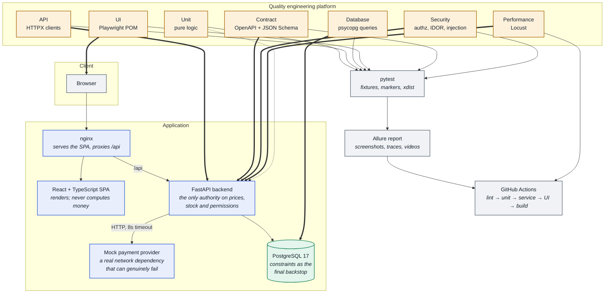
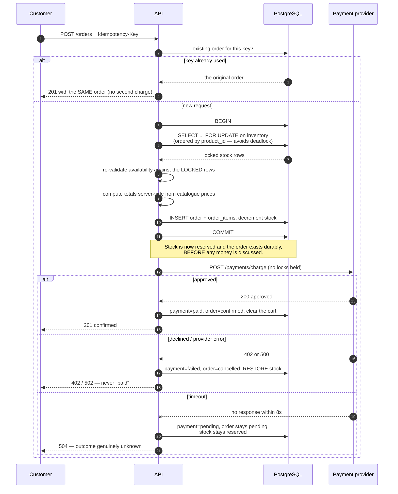

# Architecture

## Contents

- [System overview](#system-overview)
- [Component diagram](#component-diagram)
- [Backend layering](#backend-layering)
- [Database design](#database-design)
- [The checkout sequence](#the-checkout-sequence)
- [Quality engineering layer](#quality-engineering-layer)
- [Technology decisions](#technology-decisions)

---

## System overview

ShopSphere is four processes. The split is not decoration: each boundary exists
because something on the other side of it needs to be able to fail
independently.

| Service | Technology | Why it is a separate process |
| --- | --- | --- |
| **Storefront** | React 18 + TypeScript, built by Vite, served by nginx | A browser-facing artifact with its own build and cache lifecycle. Serving it from nginx means no Node process runs in production. |
| **API** | Python 3.12 + FastAPI + SQLAlchemy 2 | The only component trusted with business rules. Every price, every stock decision and every authorisation check happens here. |
| **Payment provider** | Python + FastAPI | Deliberately separate so a timeout is a *real* socket timeout and a 500 is a *real* 500. An in-process stub could not test the backend's actual failure handling. |
| **Database** | PostgreSQL 17 | Holds the last line of defence — `CHECK (quantity >= 0)` protects against overselling even if the application logic were bypassed entirely. |

---

## Component diagram



**Reading the arrows.** Solid arrows are runtime dependencies. Thick arrows
(`==>`) are the test platform driving a real, running component — no mocks, no
in-process test client. The dotted line from *Unit* to the API means unit tests
import the application's own modules but make no I/O calls at all.

---

## Backend layering

Four layers, each with one reason to change:

```
  app/api/v1/*.py          HTTP concerns only: routes, status codes, OpenAPI docs.
        │                  Never contains a business rule.
        ▼
  app/services/*.py        Business rules. Transaction boundaries, orchestration.
        │                  pricing.py and inventory.py are pure and I/O-free,
        ▼                  which is what makes them exhaustively unit-testable.
  app/repositories/*.py    Queries. All SQL lives here, so an index change or a
        │                  column rename touches one file.
        ▼
  app/models/*.py          SQLAlchemy ORM + constraints.
```

**Why `pricing.py` imports nothing.** It has no database, framework or network
imports. That is the single most consequential design decision in the backend:
it means every rounding rule, discount cap and tax boundary can be tested
exhaustively in milliseconds with no fixtures. 66 of the project's unit tests
live there.

**Where transactions begin and end.** `get_db()` yields a session but never
commits. Services own their transaction boundaries explicitly, which is what
allows checkout to be atomic across five different tables instead of
accidentally committing halfway through.

---

## Database design

```mermaid
erDiagram
    ROLES ||--o{ USERS : "grants"
    USERS ||--o{ ADDRESSES : "owns"
    USERS ||--o| CARTS : "has one"
    USERS ||--o{ ORDERS : "places"
    CARTS ||--o{ CART_ITEMS : "contains"
    CATEGORIES ||--o{ PRODUCTS : "groups"
    PRODUCTS ||--|| INVENTORY : "stock tracked by"
    PRODUCTS ||--o{ CART_ITEMS : "referenced by"
    PRODUCTS ||--o{ ORDER_ITEMS : "purchased as"
    ORDERS ||--|{ ORDER_ITEMS : "contains"
    ORDERS ||--o{ PAYMENTS : "charged by"
    ADDRESSES |o--o{ ORDERS : "shipped to"

    ROLES {
        int id PK
        string name UK "customer | admin"
        text description
    }

    USERS {
        int id PK
        string email UK "stored lowercase"
        string password_hash "bcrypt, cost 12"
        string full_name
        string phone
        int role_id FK
        bool is_active "re-read every request"
        timestamptz created_at
    }

    ADDRESSES {
        int id PK
        int user_id FK "ON DELETE CASCADE"
        string label
        string full_name
        string line1
        string city
        string state
        string postal_code
        string country "ISO-3166 alpha-2"
        bool is_default
    }

    CATEGORIES {
        int id PK
        string name UK
        string slug UK
    }

    PRODUCTS {
        int id PK
        string sku UK
        string name "idx lower(name)"
        text description
        numeric price "NUMERIC(10,2), CHECK >= 0"
        int category_id FK "ON DELETE RESTRICT"
        string brand "indexed"
        numeric rating "CHECK 0..5"
        string image_url
        bool is_active "soft delete only"
    }

    INVENTORY {
        int id PK
        int product_id FK-UK "one row per product"
        int quantity "CHECK >= 0 - the backstop"
        timestamptz updated_at
    }

    CARTS {
        int id PK
        int user_id FK-UK "one cart per user"
    }

    CART_ITEMS {
        int id PK
        int cart_id FK "ON DELETE CASCADE"
        int product_id FK
        int quantity "CHECK > 0"
    }

    ORDERS {
        int id PK
        string order_number UK "SS-20260827-A1B2C3"
        int user_id FK "ON DELETE RESTRICT"
        string status "pending..cancelled"
        string payment_status "pending|paid|failed|refunded"
        numeric subtotal
        numeric discount_total
        numeric tax
        numeric shipping_fee
        numeric total "CHECK >= 0"
        string promo_code
        string idempotency_key "UNIQUE(user_id, key)"
        string shipping_line1 "snapshotted, not a join"
        string shipping_city
        string shipping_postal_code
        timestamptz created_at
    }

    ORDER_ITEMS {
        int id PK
        int order_id FK "ON DELETE CASCADE"
        int product_id FK "ON DELETE RESTRICT"
        string product_name "snapshot"
        string sku "snapshot"
        numeric unit_price "snapshot - price at purchase"
        int quantity "CHECK > 0"
        numeric line_total
    }

    PAYMENTS {
        int id PK
        int order_id FK
        string provider_reference
        numeric amount
        string status
        string card_last4 "never the full number"
        string failure_code
        int attempt "one row per attempt"
    }

    PROMOTIONS {
        int id PK
        string code UK
        string discount_type "percentage | fixed"
        numeric value
        numeric min_subtotal
        numeric max_discount
        bool is_active
        timestamptz valid_to
        int times_used
    }
```

### Four decisions worth explaining

**1. Inventory is its own table, not a column on `products`.**
Stock is the hot, contended value. Separating it means `SELECT ... FOR UPDATE`
during checkout locks *only* the stock row — two customers buying the last unit
serialise against each other while thousands of other shoppers browse the
catalogue unblocked.

**2. Orders snapshot both the address and the price.**
`order_items.unit_price` and the `orders.shipping_*` columns are copies, not
joins. A customer who edits their address next month, or a catalogue price that
changes tomorrow, must not retroactively rewrite what an order said. There are
tests for exactly this in `tests/database/tests/test_persistence.py`.

**3. `UNIQUE (user_id, idempotency_key)`.**
This constraint — not application logic — is what makes a double-clicked "Place
order" button safe. Two simultaneous requests both pass the "does this key
exist?" check; the database lets exactly one commit, and the loser's entire
transaction (including its stock decrement) rolls back.

**4. Enums are `VARCHAR + CHECK`, not native PostgreSQL enums.**
Native enums cannot have values added inside a transaction and make Alembic
downgrades awkward. A `CHECK` constraint is equally safe and migrates cleanly.

---

## The checkout sequence

The highest-risk path in the application. The ordering of its steps is
deliberate.



**Why stock is reserved before the charge (steps 5–8).**
If payment came first, a slow provider would leave the last unit of stock
sellable to somebody else for the whole eight seconds a customer spends paying.
Reserving first makes overselling impossible; restoring on failure makes it
correct.

**Why the charge happens outside the transaction (step 9).**
A provider that takes eight seconds must not hold inventory row locks for eight
seconds. That would serialise *every* checkout in the shop behind one slow card.

**Why a timeout does not roll anything back.**
Declined and errored charges are *known* not to have taken money. A timeout is
not: the charge may well have succeeded. Guessing either way is wrong, so the
order is left pending with stock still held and the customer is told it is
awaiting confirmation. A production system would add a reconciliation job —
noted honestly in the README's *Known limitations*.

---

## Quality engineering layer

```
tests/
├── api/          clients/  · reusable HTTP clients, one per bounded context
│                 tests/    · status, body, schema, headers, timing, business rules
├── ui/           pages/    · Page Objects (locators, not actions)
│                 tests/    · component behaviour + full E2E journeys
├── database/     queries/  · every SQL statement (never inline in a test)
│                 tests/    · schema contract + what the API persists
├── integration/            · multi-component journeys and real concurrency races
├── contract/               · live responses validated against the live OpenAPI spec
├── security/               · authz, IDOR, injection, headers, data exposure
├── performance/  locust/   · weighted user behaviour + staged load shape
├── fixtures/               · pytest fixtures, split by concern
├── test_data/              · factories and parametrised datasets
├── utilities/              · HTTP wrapper, JWT minting, deterministic waits
└── configuration/          · one settings object, everything from the environment
```

Three properties hold across all of it:

- **No test creates data another test depends on.** Every mutable entity is
  created by the test that mutates it, with a UUID-based identity that cannot
  collide across parallel workers.
- **No test sleeps.** `time.sleep` appears nowhere in the suite. Waiting is
  either Playwright's auto-waiting or an explicit condition poll.
- **No credentials in source.** Every URL, password and DSN comes from the
  environment.

---

## Technology decisions

| Decision | Chosen | Alternative considered | Why |
| --- | --- | --- | --- |
| Backend framework | FastAPI | Django REST, Flask | Generates the OpenAPI document the contract suite validates against, for free and always in sync. Pydantic v2 gives request validation as a type annotation. |
| ORM | SQLAlchemy 2.0 (typed) | Django ORM, raw SQL | `SELECT ... FOR UPDATE` and explicit transaction control are first-class — both are load-bearing in checkout. |
| Migrations | Alembic | hand-written SQL | Autogenerate catches drift between models and schema; `compare_type` catches the silent column-type changes that are hardest to spot in review. |
| Money type | `NUMERIC(10,2)` + `Decimal` | float | Binary floating point cannot represent `0.10`. Totals off by a cent are a real defect class this project sets out to test for. |
| Money on the wire | JSON **number** | Pydantic's default string | `{"price": "129.99"}` breaks any client doing arithmetic. This required a custom serialiser — and it is exactly what the contract suite guards. |
| Auth | JWT, HS256, access token only | sessions, access+refresh | Stateless and simple. Revocation is handled by re-reading `is_active` on every request, so deactivation takes effect immediately. |
| Password hashing | `bcrypt` directly | `passlib` | passlib's bcrypt backend is unmaintained against bcrypt 4.x and emits deprecation warnings. One fewer indirection. |
| Payment provider | separate FastAPI service | in-process mock | A real timeout, a real 500, real socket behaviour. An in-process mock would test the mock. |
| Frontend | React + TS + Vite, plain CSS | Next.js, Tailwind | The app exists to be tested, not to showcase a framework. Plain CSS avoids a second build toolchain. |
| UI automation | Playwright | Selenium | Auto-waiting removes the single largest source of UI flakiness; traces make a CI failure diagnosable without re-running it. |
| Test data | UUID-suffixed, API-created | fixtures file, DB inserts | Uniqueness from the value itself is what makes the suite parallel-safe. Creating via the API means test data went through the real rules. |
| Reporting | Allure | pytest-html | Epic/feature/story structure, plus screenshot, video and trace attachments on failure. |

### Deliberate omissions

Things a production system would have that this one does not, and why leaving
them out was the right call for a portfolio project:

- **No Redis.** Nothing here needs a cache or a queue. Adding one to look
  impressive would be a technology with no purpose.
- **No message broker.** There is no asynchronous work. Order confirmation is
  synchronous by design so the failure modes are observable in a single request.
- **No Kubernetes.** Docker Compose starts the whole system with one command,
  which is the actual requirement.
- **No refresh tokens.** They imply a revocation store, which implies session
  state, which is the thing stateless JWTs were chosen to avoid. Logout is
  client-side token disposal, and that is stated plainly rather than glossed.
